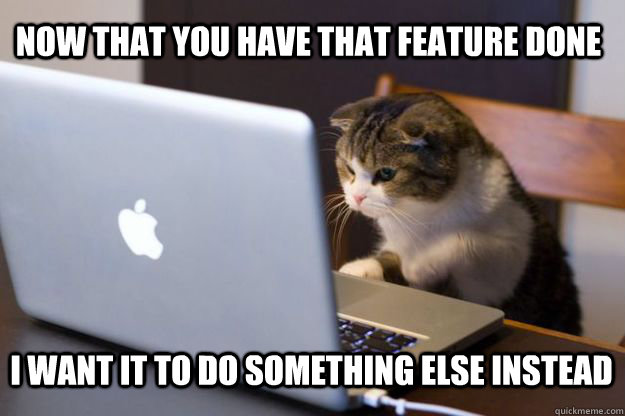

<h2>Welcome to my profile, I'm <b>Andie</b>!</h2>

### 👨🏻‍💻 &nbsp;About Me

💡 &nbsp;I am a <i>Business Analyst</i> and <i>Front-end Engineer</i>. I like to explore new technologies and develop software solutions and best practices.\
🎓 &nbsp;I'm currently majoring in Software Engineer at the University of Information Technology-VNU.\
🌱 &nbsp;I'm on track for learning more about Systems Design and Project Management.\
✍️ &nbsp;I would like to spend my whole spare time on reading blogs, listening to music and watching movies.\
💬 &nbsp;Feel free to reach out to me for consulting and volunteering, or just for some interesting discussion.\
✉️ &nbsp;You can shoot me an email at andie.tran2700@gmail.com I'll try to respond as soon as I can.

### 🛠 &nbsp;Tech Stack

&nbsp;
&nbsp;
&nbsp;
&nbsp;
&nbsp;
&nbsp;
\
&nbsp;
&nbsp;
&nbsp;
&nbsp;
&nbsp;
&nbsp;
&nbsp;

### ⚙️ &nbsp;GitHub Analytics

### 🤝🏻 &nbsp;See My City

<a href="https://honzaap.github.io/GithubCity/?name=thienan200801&year=2022">See My City</a>

### 🤝🏻 &nbsp;Connect with Me

<i>Credits to <a href="https://github.com/AVS1508">AVS1508</a> for this template </i>

